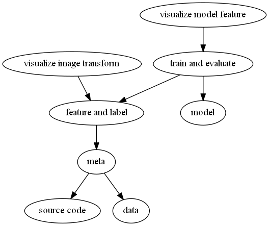

# COVID-CXR-Classification
This project built a pipeline with multiple trained models to classify Chest X-Ray images into Normal/Penumonia/COVID-19. 

## Features
- **DVC pipeline** (with simple CLI for setup and run) to reproduce and version control the whole process
- **Segmentation** and **Adaptive Histogram Equilization** with OpenCV in preprocess
- Over **20,000** CXRs and labels
- **Visualization** of image transformation for clarification
- Trained models including **ResNet**, **VGGNet**, [COVID-Net][1] with tensorflow and pytorch.
- **Augmentation** in training
- **Grad-CAM Visualization** of model feature for clarification
- **Hyperparameter** tunning for ETL, training, evaluating, models, visualization.


## Environment
Main software packages include:
```
  - conda=4.9.1
  - python=3.6
  - pyspark=3.0.1
  - pytorch=1.3.1
  - tensorflow=2.3.1
  - dvc==1.10.2
  - torchvision=0.4.2
  - scikit-learn
  - numpy
  - scipy
  - pandas
  - matplotlib=3.1.0
  - pydicom
  - opencv
  - ipython
  - notebook
  - jupyter
  - ipykernel
  - pip
```

## Setup
0. Set up Python, Anaconda, Git, a cloned copy of the project
1. Create environment with
```
conda env create -f env.yml
```
2. For Windows OS, build pipeline with
```
setup
```

## Usage
For Windows OS, run pipeline with
```
run
```

## Pipeline
The pipeline is built on DVC ([Data Version Control](https://dvc.org/doc/start)). It caches and versions data flow, constructs a DAG ([directed acyclic graph](https://en.wikipedia.org/wiki/Directed_acyclic_graph)) used to reproduce the whole procedure. The DAG consists of series of ordered stages with dependenceis and outputs including hyperparameter setting.

### DAG


### Hyperparameters
[params.yaml](params.yaml) is the hyperparameter file to construct pipeline in DVC, and for user to fine-tune the whole process from ETL, model setup to training and visualization. 

### Data
#### Data Source
### Preprocess
#### META ETL
Image number for each label is:
```python
{'pneumonia': 11092, 'normal': 10340, 'covid': 617}
```
#### DATA ETL
### Model
#### Trained model and weights
### Demo

## Issues

## Todo

## References
[1]: <https://github.com/lindawangg/COVID-Net>
